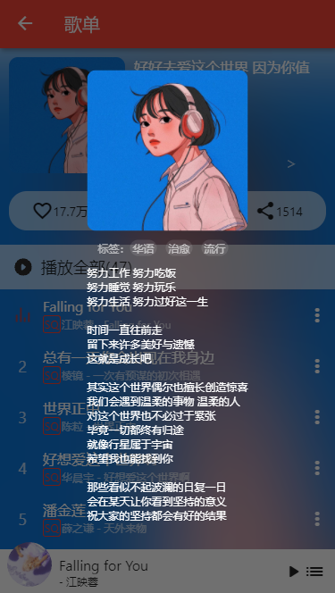
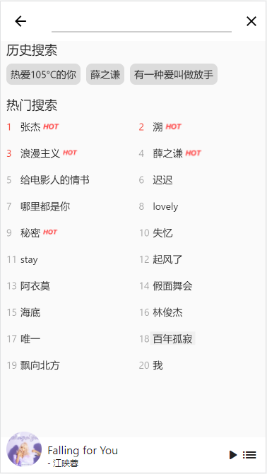

# 简单的仿网易云移动端

A new Flutter project.

## 说明

- 线上预览：https://flutter-music.vercel.app/#/
- 数据来源：https://github.com/Binaryify/NeteaseCloudMusicApi
- 说明：实现主要的音乐播放功能，其他有生之年再搞，也可能鸽了

## 截图

  
  

## Getting Started

This project is a starting point for a Flutter application.

A few resources to get you started if this is your first Flutter project:

- [Lab: Write your first Flutter app](https://flutter.dev/docs/get-started/codelab)
- [Cookbook: Useful Flutter samples](https://flutter.dev/docs/cookbook)

For help getting started with Flutter, view our
[online documentation](https://flutter.dev/docs), which offers tutorials,
samples, guidance on mobile development, and a full API reference.
